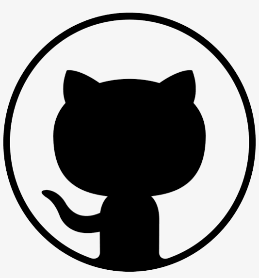
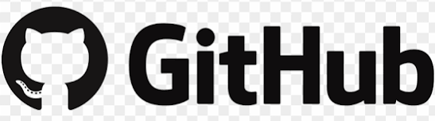

# 🌌 Hub Panorâmico Visual · Mapeamento de Ideias & Contextos

Este acervo funciona como a infraestrutura central de apoio para os elementos visuais do meu portfólio.

## 🧬 Estrutura do Repositório
Um guia simples projetado para organizar de forma fluída o acesso as mídias:
-   🗂️ [`badges-artigos_e_projetos`](./badges-artigos_e_projetos) -> Evidências de aprendizado contínuo e evolução em novas tecnologias.
-   🗂️ [`banners-hub`](./banners-hub) -> Elementos de síntese gráfica desenhados para otimizar a experiência de leitura.
-   🗂️ [`banners-perfil`](./banners-perfil) -> Composições de posicionamento e identidade profissional.
-   🗂️ [`presenca-digital`](./presenca-digital) -> Selos e conexões de ecossistemas e redes corporativas.

## 🖼️ Painel Funcional de Criações Digitais
### O Sentido por Trás das Imagens

Compartilho o conceito estrutural deste acervo. Cada item demonstra como o cruzamento de tecnologia e uma visão ampla pode transformar informações dispersas em um panorama interessante e harmonioso:

| Área de Aplicação | Prévia Visual | Conceito & Intenção Estratégica |
| :--- | :---: | :--- |
| **Apresentação&nbsp;Pessoal**<br> perfil&nbsp;&&nbsp;ilustração&nbsp;autoral<br> ```visão [1]``` |  | Arquitetura estética estrutural de uma ponte sutil entre a clareza técnica e o fator humano. |
| **Hub&nbsp;Principal&nbsp;de&nbsp;Projetos**<br> síntese&nbsp;de&nbsp;conteúdo<br> ilustração&nbsp;autoral<br> ```prisma da curadoria [2]``` | | Simbologia do prisma da curadoria como simplificação do complexo (caos em ordem). Uma proposta prática para transformar ideias densas em um roteiro funcional e atraente. |
| **Presença&nbsp;Digital**<br> pontes&nbsp;de&nbsp;interação |  &nbsp;  &nbsp;  | Integração sutil de canais, comunidades de tecnologia e redes de negócios profissionais. |
| **Identidade&nbsp;Corporativa**<br> logos |  &nbsp;  &nbsp;   | Elementos de marcas institucionais. |
| **Formação&nbsp;&&nbsp;Bootcamps**<br> repertório&nbsp;&&nbsp;evolução |  &nbsp;  &nbsp;  &nbsp;  | Registro de atualização constante (Dio Campus Expert turma 16 & Bootcamps Caixa | Heineken | Michael Page). Flexibilidade para absorver novos cenários e metodologias de mercado. |
| **Artigo&nbsp;&&nbsp;Arte&nbsp;Autoral**<br> capa&nbsp;principal<br> ```árvore digital [3]``` |  | *Mídia refinada via IA através da calibragem por camadas.*<br> Analogia a carreira, jamais uma carreira terá uma trajetória idêntica à outra, sempre será única, assim como os ramos de uma árvore, nascem de um mesmo ponto, embora sejam parecidos, seguem bifurcações diferentes e únicas. |
| **Artigo&nbsp;&&nbsp;Arte&nbsp;Autoral**<br>ilustração&nbsp;complementar<br> ```malha de dados digital [4]``` |   | *Mídia refinada via IA através da calibragem por camadas.*<br> Independente do volume de dados, consumo sem critério, leva a fadiga, então se faz necessário ordenar os dados através de curadoria da informação. |
| **Artigo&nbsp;&&nbsp;Arte&nbsp;Autoral**<br>ilustração&nbsp;complementar<br> ```camadas flutuantes [5]``` |  | *Mídia refinada via IA através da calibragem por camadas.*<br> Composição visual do processo de calibragem de megaprompts por camadas simétricas, equilibradas, ordenadas, agindo como filtros obtendo resultados mais refinados. |

## ⚛️ Metodologia de Criação
A abordagem é baseada no conceito do **Minimalismo Estrutural**, eliminando excessos e evidenciando os resultados. A tecnologia através da IA atua como um exponencial para o discernimento humano. O resultado é um fluxo de trabalho flexível, adaptável a qualquer desafio e focado em gerar soluções inteligentes e fora do óbvio.

## ✨ Inspiração e Uso da Comunidade 

Este repositório abraça a cultura de compartilhamento do GitHub. Sinta-se à vontade para compartilhar, copiar, redistribuir, remixar, utilizar, transformar e construir ou se inspirar na estrutura de pastas, no modelo de organização desta tabela em Markdown, nas composições gráficas, layouts, cabeçalhos, banners e conceitos estéticos criados.

As ```5 composições personalizadas (perfil, hub e artigos autorais)```, ilustram minha narrativa gráfica autoral e moldam o meu perfil pessoal exclusivo, então, caso decida utilizar alguma composição autoral de forma direta e sem modificações desses ```5 banners reservados a este portfólio```, a atribuição de créditos ao meu perfil, provendo um link para este repositório original e indicando se mudanças foram feitas será sempre muito bem-vinda e fortalecerá a nossa comunidade de tecnologia! Agradeço a compreensão por manter a originalidade dessas narrativas visuais e encorajo você a usar o método de calibragem para criar a sua própria vitrine única!

*Nota: Os logotipos institucionais de terceiros, marcas comerciais e insígnias oficiais de certificação e bootcamps pertencem legalmente às suas respectivas instituições e foram organizados aqui apenas para fins de portfólio acadêmico e profissional.*

---
*Foco: Clareza \| Precisão \| Organização*

---
🔗 **Navegação:** Acesse [meu HUB PRINCIPAL de Projetos & Soluções Estratégicas](https://github.com/Kat-Ak/hub_projetos-DIO) | ⬅️ Voltar ao [Perfil Geral](https://github.com/Kat-Ak)
